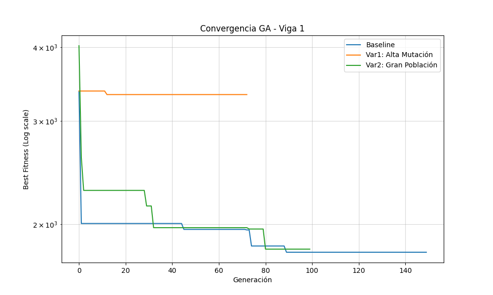
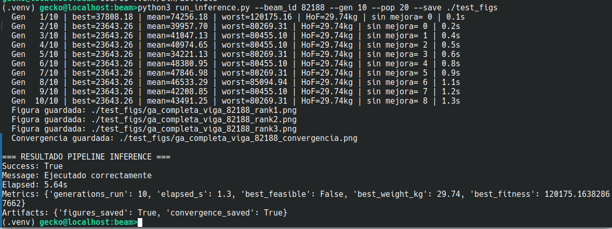

# Beam RC Optimization
## Alumnos
- Efrain Rodriguez Infantes
- Ronald Huamani Ortega

Sistema para el **diseño óptimo de vigas de concreto armado** mediante un **algoritmo genético (GA)**.  
El proyecto toma una viga como entrada, evalúa distintas alternativas de armado y devuelve las **mejores soluciones** priorizando:

1. **Factibilidad estructural**,
2. **Menor peso total**,
3. **Constructabilidad**.

El flujo principal está orientado a optimizar simultáneamente el armado **corrido** y los **bastones** por zonas de la viga, respetando restricciones geométricas, de anclaje y de diseño.

---

## Objetivo del proyecto

El sistema busca automatizar el proceso de selección de acero de refuerzo para vigas, generando una solución optimizada que considere:

- geometría de la sección,
- resistencia del concreto,
- catálogo de diámetros de acero,
- distribución longitudinal de momentos,
- armado por capas,
- barras corridas,
- bastones en zonas críticas,
- penalizaciones por incumplimiento.

---

## Qué hace el proyecto

- Lee una viga desde un **dataset JSON** local o desde **ETABS**.
- Filtra vigas válidas según el ancho de sección soportado por la configuración.
- Ejecuta un **algoritmo genético completo** para encontrar diseños viables.
- Evalúa cada solución con criterios estructurales y constructivos.
- Genera un **top 3** de diseños.
- Produce artefactos opcionales:
  - figuras de resultados,
  - gráfica de convergencia,
  - exportación a JSON.

---

## Entregables Semana 5

### 1. Experimentos Ejecutados (A/B)
Se realizaron experimentos comparando el **Baseline** con dos variantes para evaluar la sensibilidad del algoritmo genético.

- **Baseline**: Configuración estándar (`pop_size=150`, `n_gen=200`, mutación base).
- **Variante 1 (Alta Mutación)**: Se incrementó la probabilidad de mutación (`p_mut_oni=0.25`, `p_mut_choice=0.15`) para favorecer la exploración.
- **Variante 2 (Gran Población)**: Se duplicó la población (`pop_size=300`) y se redujeron generaciones (`n_gen=100`) para evaluar diversidad vs convergencia.

#### Resultados Comparables
Los experimentos se ejecutaron sobre la viga `81189` con semilla fija (42).

| Experimento | Best Fitness | Best Weight (kg) | Feasible | Time (s) | Gens |
| :--- | :---: | :---: | :---: | :---: | :---: |
| **Baseline** | 1792.35 | 145.63 | True | 158.6 | 150* |
| **Var1: Alta Mutación** | 3325.23 | 164.66 | True | 82.3 | 73* |
| **Var2: Gran Población** | 1814.20 | 144.18 | True | 214.6 | 100 |

*\* Ejecución terminada por Early Stopping.*

#### Gráfico de Convergencia

---

### 2. Feature Set y Pipeline
- **Features Añadidas**:
    - Optimización simultánea de 2 diámetros globales (`diam_A`, `diam_B`).
    - Configuración de 6 zonas independientes de bastones.
    - Representación por capas con slots dinámicos según el ancho de viga.
- **Transformaciones**: 
    - Decodificación del cromosoma a geometría real de barras y cálculo de $\phi M_n$.
    - Reparación de cromosomas para cumplir con el número mínimo/máximo de varillas por ancho.
- **Pipeline**: Estructura basada en `BasePipeline` con pasos claros de `load` -> `preprocess` -> `run_core` -> `evaluate` -> `save_artifacts`.
- **Validación y Leakage**:
    - **Cero Leakage**: El diseño de cada viga es independiente. No hay intercambio de información entre el diseño de una viga y otra. El GA opera sobre los datos intrínsecos de la viga actual.
    - **Split Correcto**: El sistema permite seleccionar vigas por ID (`--beam_id`) facilitando holdout manual.
    - **Validación**: Se utiliza el enfoque de **holdout** (evaluación sobre vigas no vistas en el ajuste de hiperparámetros) y se valida la factibilidad estructural mediante penalizaciones en el fitness.

---

## Estructura general del proyecto

---

## Requisitos

- Python 3.10 o superior recomendado.
- Dependencias listadas en `requirements.txt`.

### Instalación
- pip install -r requirements.txt

## Punto de entrada

El script principal del proyecto es: `run_inference.py`

Aunque el nombre del archivo diga *inference*, en la práctica el proyecto ejecuta un proceso de **optimización genética** sobre una viga seleccionada.

---

## Flujo de ejecución

El flujo general es el siguiente:

1. Se cargan los datos de una viga.
2. Se valida la estructura de entrada.
3. Se ejecuta el algoritmo genético.
4. Se obtienen los mejores diseños.
5. Se generan figuras y/o JSON si se solicitan.

---

## Fuentes de datos soportadas

### 1. Dataset local

Por defecto, el sistema usa: [`data/dataset.json`] (https://drive.google.com/file/d/1rUdOkpww1dhLj6ecp5qggoSAyJx44JO5/view?usp=sharing)

Esta opción es la más simple para correr el proyecto sin integraciones externas.

### 2. ETABS

También puede conectarse a ETABS si el entorno tiene la integración correspondiente disponible.

---

## Formato esperado de la viga

Cada viga debe incluir, al menos:

- `id`
- `inputs`
- `outputs`

De forma general, el proyecto espera información como:

- ancho de la viga,
- altura de la sección,
- resistencia del concreto,
- longitud de la viga,
- diagrama de momentos o envolvente de momentos.

---

## Argumentos de línea de comandos

El script `run_inference.py` acepta los siguientes parámetros:

| Argumento | Tipo | Descripción |
|---|---:|---|
| `--beam_id` | `int` | ID de la viga a evaluar. Si no se indica, se selecciona una viga válida aleatoria. |
| `--seed` | `int` | Semilla para hacer reproducible la ejecución. |
| `--save` | `str` | Carpeta donde guardar las figuras generadas. |
| `--json_out` | `str` | Ruta del archivo JSON de salida. |
| `--pop` | `int` | Tamaño de la población del GA. |
| `--gen` | `int` | Número máximo de generaciones. |
| `--source` | `str` | Fuente de datos: `dataset` o `etabs`. |
| `--fc` | `float` | Resistencia del concreto usada al extraer desde ETABS. |

---

## Ejemplos de uso

### Ejecutar con dataset por defecto
 - `python run_inference.py`

### Seleccionar una viga concreta
 - `python run_inference.py --beam_id 12`

### Ejecutar con semilla fija
 - `python run_inference.py --beam_id 12 --seed 123`

### Cambiar tamaño de población y generaciones
 - `python run_inference.py --beam_id 12 --pop 200 --gen 300`

### Guardar figuras y exportar JSON
 - `python run_inference.py --beam_id 12 --save test_figs --json_out results.json`

### Usar ETABS
 - `python run_inference.py --source etabs --fc 210`

---

## Pipeline principal

El proyecto está organizado con una arquitectura tipo **pipeline**.

### `BasePipeline`

Define el flujo estándar:

- cargar datos,
- validar datos,
- preprocesar,
- ejecutar el núcleo,
- evaluar,
- guardar artefactos.

### `TrainingPipeline`

Es el pipeline que realmente usa el proyecto principal.  
Aunque el nombre puede sugerir entrenamiento, aquí se usa para:

- cargar una viga,
- lanzar el GA,
- evaluar el resultado,
- generar artefactos.

### `InferencePipeline`

Existe como estructura base para un flujo de inferencia separado, aunque el sistema principal se apoya en `TrainingPipeline`.

---

## Algoritmo genético

El corazón del proyecto está en `ga/beam_ga_complete.py`.

### Qué optimiza

El algoritmo busca simultáneamente:

- **2 diámetros globales**,
- **armado corrido** a lo largo de toda la viga,
- **bastones** distribuidos en 6 zonas:
  - `LEFT_TOP`
  - `MID_TOP`
  - `RIGHT_TOP`
  - `LEFT_BOT`
  - `MID_BOT`
  - `RIGHT_BOT`

### Estrategia evolutiva

Incluye:

- inicialización híbrida de población,
- selección por torneo,
- elitismo,
- cruce por bloques,
- mutación,
- reparación del cromosoma,
- historial de fitness,
- early stopping,
- reinicios parciales,
- hall of fame con top 3.

### Resultado

El algoritmo retorna un conjunto de diseños ordenados por prioridad:

1. soluciones factibles,
2. de menor peso total,
3. con mejor fitness.

#### un ejemplo de salida para:
`python3 run_inference.py --beam_id 82188 --gen 10 --pop 20 --save ./test_figs`

---

## Cromosoma

El proyecto usa una representación compacta para codificar el armado.

### Componentes principales

- índice de diámetro global A,
- índice de diámetro global B,
- bloque de corrido,
- seis bloques de bastones,
- codificación por capas, slots y elección de diámetro/activación.

### Funciones asociadas

En `ga/chromosome.py` y `ga/chromosome_utils.py` se implementan tareas como:

- codificación y decodificación,
- reparación de restricciones,
- extracción de barras activas,
- cálculo de posiciones verticales,
- generación de individuos iniciales,
- cruce y mutación.

---

## Restricciones consideradas

El sistema no solo optimiza peso, también penaliza o invalida diseños que incumplen restricciones como:

- capacidad resistente insuficiente,
- geometría incompatible,
- capas mal construidas,
- solapamientos entre corrido y bastones,
- anclaje insuficiente,
- exceso de barras o capas densas,
- constructabilidad deficiente.

---

## Configuración principal

### `config/config.py`

Contiene los parámetros generales del material y catálogo de barras, por ejemplo:

- resistencia del acero,
- módulo de elasticidad,
- recubrimientos,
- catálogo de varillas,
- áreas y diámetros,
- límites por ancho de viga.

### `config/config_ga.py`

Contiene los parámetros del algoritmo genético y reglas estructurales, incluyendo:

- población,
- generaciones,
- torneo,
- elitismo,
- probabilidades de cruce y mutación,
- early stop,
- reinicio parcial,
- penalizaciones,
- longitudes de anclaje,
- parámetros de constructabilidad.

---

## Salidas del sistema
Al terminar, el proceso imprime algo similar a:

- `Success`
- `Message`
- `Elapsed`
- `Metrics`
- `Artifacts`

### Métricas típicas
Entre las métricas reportadas se incluyen:

- generaciones ejecutadas,
- tiempo total,
- si hubo early stop,
- mejor solución factible,
- peso de la mejor solución,
- fitness de la mejor solución.

---
## Artefactos generados

Dependiendo de los argumentos usados, el sistema puede generar:

- imágenes por cada diseño del top 3,
- una gráfica de convergencia,
- un archivo JSON con el resultado completo.

---

## Visualización
El proyecto incluye utilidades de visualización para mostrar:

- diagrama de momentos,
- capacidad resistente comparada con la demanda,
- elevación esquemática del armado,
- secciones transversales por tercio de viga,
- evolución del fitness durante las generaciones.

Las figuras se guardan en el directorio indicado con `--save`.

---

## Dependencias
Las dependencias principales del proyecto incluyen:

- `numpy`
- `matplotlib`
- `pillow`
- `cycler`
- `contourpy`
- `fonttools`
- `kiwisolver`
- `packaging`
- `pyparsing`
- `python-dateutil`
- `six`

---

## Uso recomendado
Una forma práctica de correr el sistema es:
 - `python run_inference.py --beam_id 1 --seed 123 --save test_figs --json_out results.json`

Esto permite:

- reproducibilidad,
- visualización de resultados,
- exportación de la solución.

---

## Notas importantes

- Si no se especifica `--beam_id`, el sistema selecciona una viga válida aleatoria.
- Si se usa `--source etabs`, debe existir la integración con ETABS en el entorno.
- El proyecto filtra vigas según el ancho soportado por la configuración.
- La solución final no es solo una propuesta de armado, sino una **optimización con restricciones de diseño estructural**.

---
